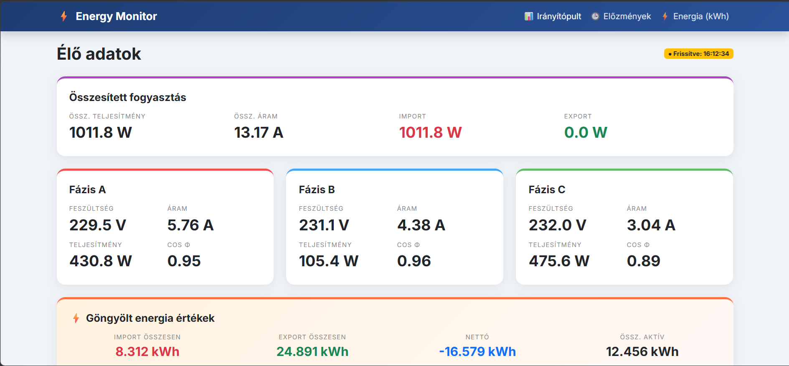

# Live 3-Phase Energy Dashboard (F# WebSharper Project)

Course: Introduction to Functional Programming in F#
University of Dunaújváros
Instructor: Adam Granicz

## Project description

This project is a high-performance energy monitoring dashboard developed in F# using the WebSharper framework. The application provides real-time visualization of electrical data, bridging the gap between raw IoT telemetry and actionable insights.
The system operates in a distributed environment:
Central Data Server: A high-capacity physical server hosting a PostgreSQL database. This server acts as the central data hub, continuously collecting and archiving 3-phase energy metrics.
Development & Hosting Node: A Lenovo ThinkCentre M710q workstation running Linux, used for development, F# coding, and serving the web interface.

## Motivation & Architecture

The core motivation was to build a completely independent, custom-built monitoring system instead of relying on pre-packaged smart-home platforms. This standalone approach allows for maximum control over data processing and UI performance.

By separating the data collection (Backend Server) from the visualization (Web App), the system remains responsive even during heavy data processing. The development workflow was strictly Linux-based (on the Lenovo M710q), leveraging the cutting-edge .NET 10 ecosystem.

The architecture demonstrates a "Decoupled Design," where the lightweight frontend node offloads heavy data storage and complex queries to a dedicated backend server, ensuring high-frequency updates without latency.

## Features

Standalone Solution: No dependence on Home Assistant or other monolithic smart-home platforms.

Decoupled Architecture: Remote database integration allows the application to run on a development workstation while accessing a powerful central server.

3-Phase Power Monitoring:

Real-time Active, Apparent, and Reactive power tracking.

Detailed per-phase (L1, L2, L3) analysis: Voltage, Current, and Power Factor.

Modern Tech Stack: Developed using the latest .NET 10 features and F# functional paradigms.

Secure Configuration: Sensitive connection strings are managed via .env files.

Reactive UI: Automatic 5-second data polling using WebSharper's reactive components.

## Technologies used

The project was implemented using the following technologies:

The project was implemented using the following technologies:

    F# / WebSharper (Functional full-stack development)

    .NET 10 (Latest runtime and SDK)

    PostgreSQL & Npgsql (Time-series data storage and access)

    ASP.NET Core (Web hosting)

    Node-RED (Data orchestration)

    JSON HTTP API (Data exchange)

    Git / GitHub / GitHub Pages (Version control and demo hosting)

## Project Structure

    Database.fs: Contains the F# logic for connecting to the remote physical server and mapping SQL results to functional records.

    Client.fs: The reactive frontend logic, handling live UI updates and data polling.

    Startup.fs: Configures the ASP.NET Core hosting environment.

    .env: Local configuration file for the remote server's IP and authentication.

## Live demo link

The project is available online via GitHub Pages:

https://cslazok.github.io/ha-dashboard/

Since GitHub Pages supports only static websites, the live demo version runs in demo mode using sample measurement data stored in a JSON file.

## Screenshot

## Future improvements

Possible future extensions of the project include:

- historical energy charts
- mobile layout optimization
- alert system for abnormal consumption
- database integration for long-term storage
- Home Assistant integration support

## Author

Dániel Csaba Lázok
University of Dunaújváros
Course: Introduction to Functional Programming in F#
